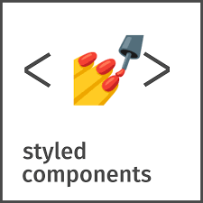

# CSS in JS란

`styled-components`와 `Emtoion`을 설명하기 전에 CSS in JS의 개념을 설명하겠습니다.
CSS in JS는 스타일 정의를 CSS 파일이 아닌 JavaScript로 작성된 컴포넌트에 삽입하는 스타일 기법입니다.

최근에는 웹 애플리케이션을 여러 개의 재활용이 가능한 블록으로 분리하여 개발하는 컴포넌트 기반 개발 방법이 주류가 되고 있습니다.

# styled-components

# Emotion

# Ref

- [Styled Components로 React 컴포넌트 스타일하기](https://www.daleseo.com/react-styled-components/)