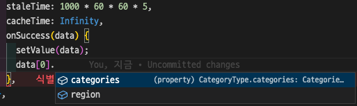

> 해당 게시물은 [김세이](https://github.com/KIMSEI1124)가 작성하였습니다.

# 자바스크립트

---

자바스크립트의 첫 번째 특징으로는 객체 기반의 스크립트 언어입니다.

두 번째 특징으로는 동적이며, **타입을 명시할 필요가 없는 인터프리터 언어**입니다.

세 번째 특징으로는 객체 지향형 프로그래밍과 함수형 프로그래밍을 모두 표현할 수 있습니다.

자바스크립트의 특징중 타입을 명시할 필요가 없는데 이것은 "**런타임에서 오류를 발견하게 되는 큰 단점**"이 있습니다.

# 타입스크립트

---

타입스크립트는 정적 타입의 컴파일 언어이며 타입스크립트 컴파일러 또는 바벨(Babel)을 통해 자바스크립트 코드로 변환됩니다.
코드 작성 단계에서 타입을 체크해 오류를 확인할 수 있고 미리 타입을 결정하기 때문에 실행 속도가 매우 빠르다는 장점이 있습니다.

> 하지만 코드 작성 시 매번 타입을 결정해야 하기 때문에 번거롭고 코드량이 증가하며 컴파일 시간이 오래 걸린다는 단점이 있습니다.

타입스크립트는 `ES6`에서 새롭게 사용된 문법을 포함하고 있으며 클래스, 인터페이스, 상속, 모듈 등과 같은 객체 지향 프로그래밍 패턴을 제공합니다.

```ts withLineNumbers
interface LikeButtonProps {
  liked: boolean;
  onClick: () = void;
}
```

## 타입스크립트 사용을 고려해야 하는 이유

---

타입스크립트는 코드에 목적을 명시하고 목적에 맞지 않는 타입의 변수나 함수들에서 에러를 발생시켜 버그를 사전에 제거합니다.
또한 코드 자동완성이나 실행 전 피드백을 제공하여 작업과 동시에 디버깅이 가능해 생산성을 높일 수 있습니다.
실제로 한 연구에 따르면 모든 **자바스크립트의 버그의 15%가 사전에 타입스크립트로 감지**할 수 있다고 합니다.

> 아래의 코드와 사진은 실제로 개발을 할 때 사용했던 `Hook` 입니다. `CategoryType`의 타입을 지정해서 자동완성 기능이 동작하는 것을 확인할 수 있습니다.

```ts withLineNumbers
function useDrinkUpperCategory() {
  const [value, setValue] = useRecoilState<CategoryType[]>(drinkUpperCategoryState);

  const requestCategory = useQuery(QUERY_KEY.DRINK_UPPER_CATEGORY, requestDrinkUpperCategory, {
    staleTime: 1000 * 60 * 60 * 5,
    cacheTime: Infinity,
    onSuccess(data) {
      setValue(data);
    },
  });

  return { value, setValue: requestCategory };
}
```



타입스크립트는 자바스크립트와 100% 호환됩니다. 자바스크립트를 사용하는 곳이라면 그 어디에서든 사용할 수 있다는 장점이 있습니다.
또한 프론트엔드 혹은 백엔드까지 작성할 수 있어서 복잡한 대형 프로젝트에서도 강력하게 동작합니다.

타입스크립트는 강력한 생태계를 가지고 있는데 그리 오래되지 않은 언어임에도 불구하고 대부분의 라이브리러들이 타입스크립트를 지원합니다.
VSCode를 비롯해 각종 에디터가 타입스크립트 관련 기능과 플러그인을 지원합니다.

# 타입스크립트를 선택한 이유

---

타입스크립트를 처음 접했을 때 `tsconfig.json` 과 같이 설정할 것이 많아 새로운 기술에 대한 두려움이 있었지만
타입스크립트를 선택한 가장 큰 이유는 **코드에 목적을 명시하고 목적에 맞지 않는 타입의 변수나 함수들에서 에러를 발생시켜 버그를 사전에 제거할 수 있기 때문**입니다.

**15**%의 버그를 사전에 감지 할 수 있다는 것은 크나큰 장점으로 생각하고 있으며 대부분의 라이브러리들이 호환되어 거부감 없이 팀원들과 소통하여 자바스크립트가 아닌 타입스크립트를 선택하였습니다.

# Ref

---

- [TCP SCHOOL.com - 자바스크릅트 기초](http://www.tcpschool.com/javascript/js_intro_basic)
- [활용도가 높아지는 웹 프론트엔드 언어, 타입스크립트(TypeScript)](https://www.samsungsds.com/kr/insights/typescript.html)
